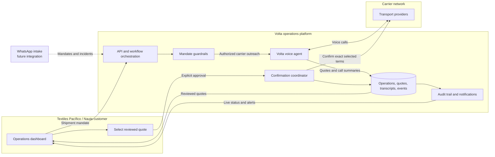

# Volta architecture

This diagram describes the current product workflow. The customer remains the
commercial decision-maker; Volta automates coordination within the recorded
mandate.

## Control boundary

Volta may collect offers and confirm an explicitly selected carrier. It may not
select a carrier, alter the mandate, accept changed terms, or make an
unapproved booking. Conditions outside the mandate create an auditable failure
or escalation for a human decision.

## Core integrations

| Integration      | Role                                                                          |
| ---------------- | ----------------------------------------------------------------------------- |
| Dashboard        | Creates mandates, exposes quotes, receives selection and alerts.              |
| Telephony        | Places carrier outreach and confirmation calls.                               |
| AI services      | Runs voice dialogue and extracts structured call outcomes.                    |
| Operations store | Persists mandates, calls, quotes, transcripts, selections, and notifications. |
| WhatsApp         | Planned inbound channel for mandates and incidents.                           |
